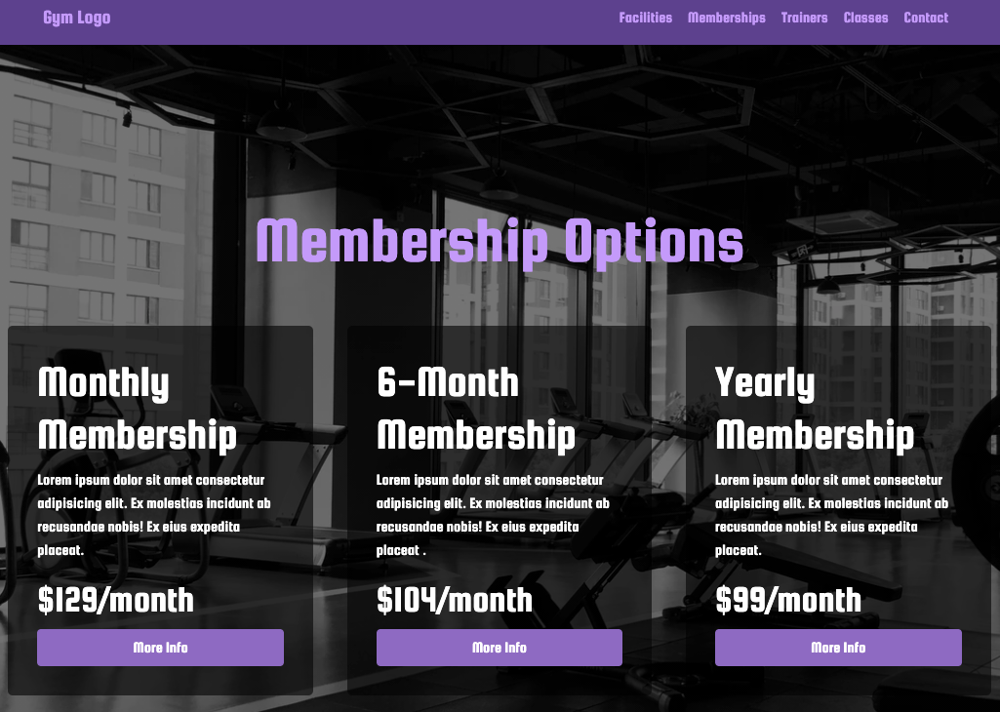
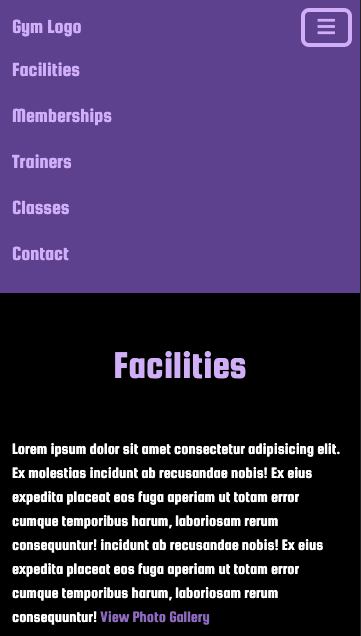

# Gym Website

A simple website for a gym client

## Technologies

- HTML
- CSS
- [Bootstrap](https://getbootstrap.com/)
- JavaScript/jQuery
- [mockAPI.io](https://mockapi.io/)
- [Font-Awesome](https://fontawesome.com)

## Screenshots

### Wireframes

### Images of App

Desktop view:

Mobile view:

## Getting Started

Click here to visit working App

## Future Enhancements

- Add Carousel for facility images
- Add Contact sign up sheet modal or seperate page for sign up information
- Add Modal/page for each individual trainer/class for more info and details including sign up options
